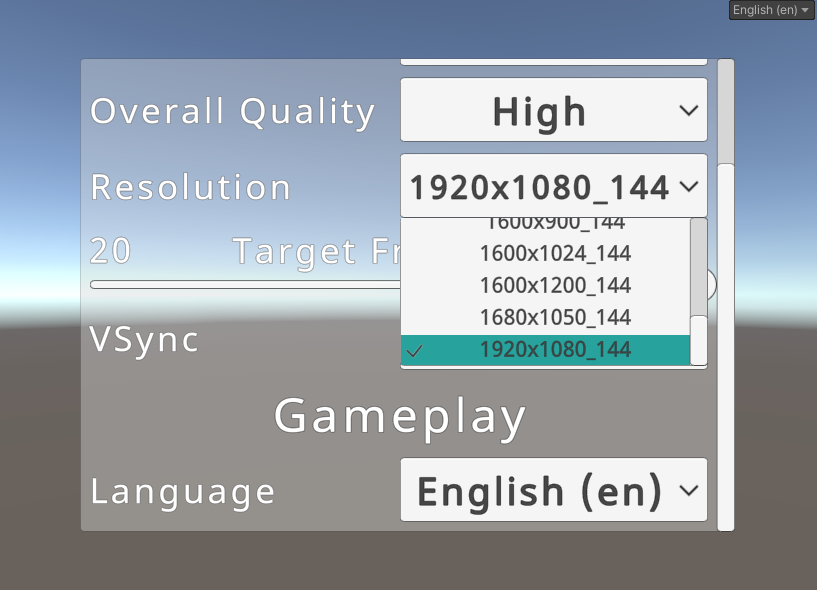

# Unity Scriptable Settings

A tool to help with creating, localizing, and subscribing to serializable user preferences.

I packaged this so I can use it in all my projects, I highly doubt it'll be useful to anyone else. I'm also trying practice making maintainable packages, as this seems to be the best way for me to make maintainable and portable code for myself.



## What is it?

Unity has made it pretty difficult to change arbitrary settings, this project serves as a platform to easily create new menu options and create listeners that can respond to settings changing.

For example changing Anti-aliasing settings needs to happen on every Camera, every post process volume, and sometimes in the quality settings themselves. (The same can be said for shadows, lights, and several other quality settings within Unity.)

A ScriptableSetting object intends to tackle this issue by allowing scripts within the scene read the current anti-aliasing value, and even subscribe to an event for when it changes. 

## Features

* Full blown localization: in fact it's unusable without it! Every menu option and setting is designed with it being used by people of many languages.
* Controller support: Proper navigation and some helper scripts to allow a controller to tab through the options via the Unity Event System without a hassle.
* Late initialization: The problem of pure scriptable objects is that they initialize **very** early in Unity's initialization. This prevents them from being able to manipulate graphics, screen, or localization settings on Start(). A required singleton ScriptableSettingManager allows them to initialize at the right time, and even spawn Coroutines for asyncronous tasks.
* Direct Unity integration: Specific settings directly manipulate Unity's default player preferences, so the game can boot at the right resolution and quality setting (without needing to wait for a full initialization).

## Instructions on use

Each ScriptableSetting is simply a float value with a min and max value, but it can currently be represented by one of three types:

* ScriptableSettingDropdown
    - A dropdown containing arbitrary strings, used for resolutions and other non-localizable lists.
* ScriptableSettingLocalizedDropdown
    - A dropdown containing localized strings, specifically used for on/offs, TAA/FAA/MSAA and low/medium/high type options.
* ScriptableSettingSlider
    - A slider for things like target framerates, density sliders, panini projection amounts, fovs.

For example if you wanted to create an option to enable or disable Ambient Occlusion in URP--

1. I would create a new class that inherits `ScriptableSettingLocalizedDropdown` and takes a reference to the ForwardRenderer.
2. Create an instance of the new class in the project, and set the localized dropdown options to be "off" and "on".
3. Within the inherited class, I would check if the value is 0, and scan the forward renderer for features to turn off the Ambient Occlusion feature. (or turn it on)
4. Drag the instance of the object into the ScriptableSettingManager, this would allow it to show up in menus for the user to change, and properly save and load their preferences to disk.

Some options can be super simple as well, if you wanted an option to disable grass in a scene-- All you'd need to do is Create->Unity Scriptable Setting->Localized Dropdown and fill it out. Then create a GenericSettingListener in the scene that disables and enables the grass based on that setting. Piece of cake!

All options are serialized to Unity's PlayerPrefs via `ScriptableSettingManager.instance.Save()`. Make sure a manager is in the scene with a reference to every setting you want it to load/save.

Make use of delegates and UnityEvents to cleverly drive your settings!

## Installation instructions

Simply add `https://github.com/naelstrof/UnityScriptableSettings.git#upm` as a package using the package manager.

Or if that doesn't work, add it to the manifest.json like so.

```
{
  "dependencies": {
    "com.naelstrof.unityscriptablesettings": "https://github.com/naelstrof/UnityScriptableSettings.git#upm",
  }
}
```